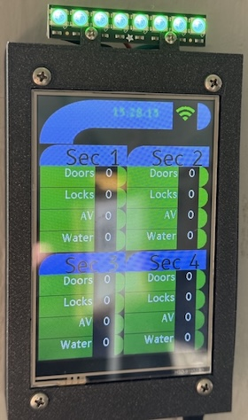
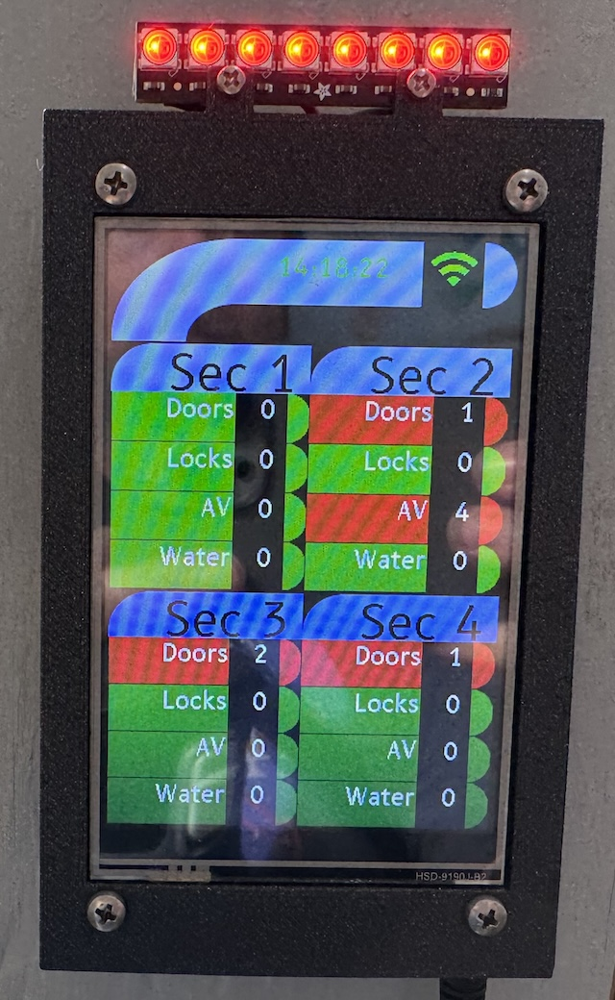
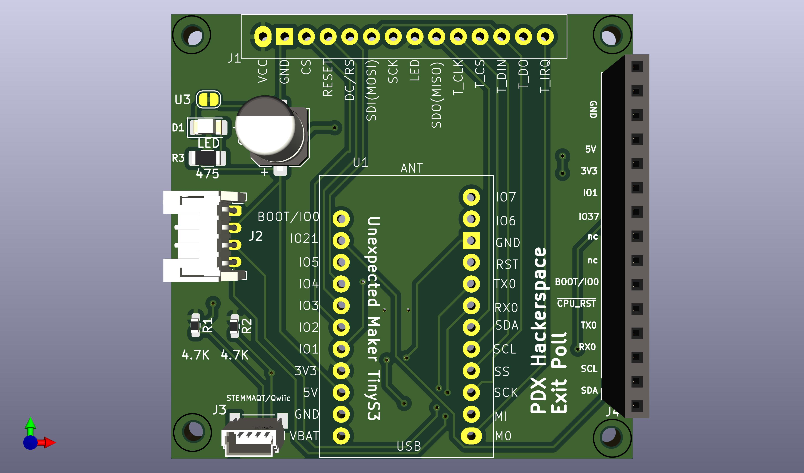
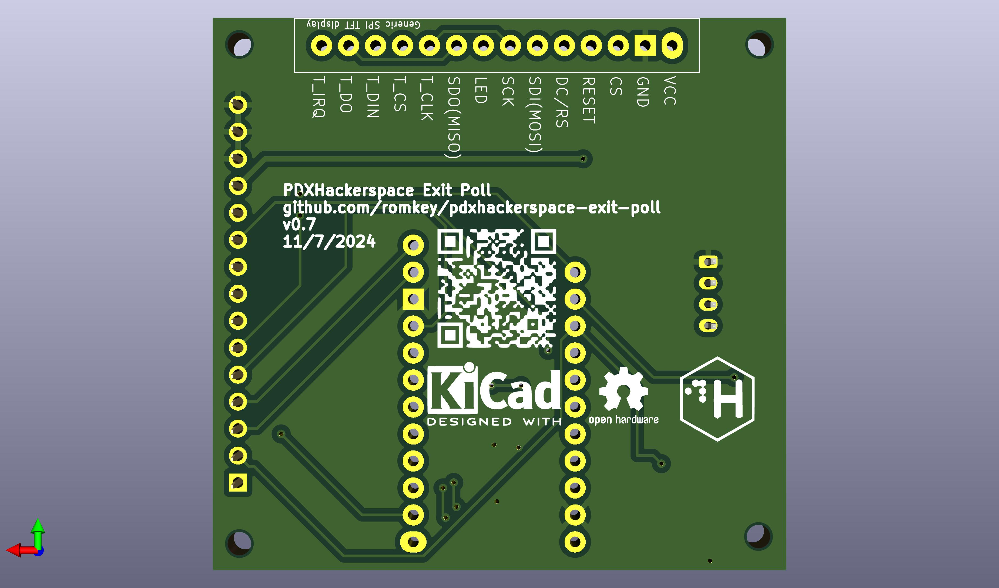

# PDX Hackerspace Exit Poll



Exit Poll is a display that integrates with Home Assistant that lets you know about things that might need attention.

At PDX Hackerspace, the last person out should check on the physical
security of the space and turn off certain equipment that may be on.
Member Kenny M had the idea of placing an electronic dashboard next to
the door so that departing members could quickly see if anything
needed attention.

We use Home Assistant to automate the space. Exit Poll uses Home
Assistant data to display counts of open doors, unlocked doors,
running water and AV equipment, all of which might need attention from
the last person to leave the space.

## Firmware

We build the firmware for this project using
[ESPHome](https://esphome.io). ESPHome is great for projects that are
tightly integrated with Home Assistant. As Home Assistant runs all our
security-related sensors, it's a good choice for us.

```
substitutions:
  name: "exit-poll"
  friendly_name: "Exit Poll"
  led_chip: "WS2812"
  led_order: "GRB"
  led_number: "8"
  display_model: "ILI9488"

packages:
  exit-poll:
    url: https://github.com/romkey/pdxhackerspace-exit-poll
    files: [esphome/exit-poll.yml, esphome/tinys3.yml]
    ref: main
    refresh: 1s

api:
  encryption:
    key: "YOUR API KEY"

ota:
  platform: esphome
  password: "YOUR OTA PASSWORD"

wifi:
  ssid: !secret wifi_ssid
  password: !secret wifi_password
#  use_address: w.x.y.z

  ap:
    ssid: "PDX Hackerspace Exit Poll Fallback Hotspot"
    password: "YOUR HOTSPOT PASSWORD"
```

## Hardware

We use cheap a 320x480 SPI TFT display connected to Unexpected Maker's
TinyS3 board on a custom PCB, but you can use virtually any ESP32
board that's fast enough with enough storage and RAM for your needs
that you solder together. We use displays with touch support - the PCB
wires the touch pins to the CPU but the firmware currently does not
take advantage of it.

If you want to use a different resolution display you'll of course
need to rewrite the code which puts information on the display.

The PCB is available at [OSHPark](https://oshpark.com/shared_projects/85wfS3FQ).



### Assembly

Most of the components on the board are optional.

C1 is entirely optional. It's intended to smooth power to the LED
strip, if you use one. In practice with just a few LEDs it's
unnecessary. We will probably drop it if we update the PCB again.

If you don't want the power indicator, omit D1 and R3.

If you don't want external I2C support via the Qwiic/Stemma QT
connector, omit R1, R2 and J3.

Although the board shows a female header strip for the connections on
the right hand side, ignore it if you're not using those for expansion
or wire them however is convenient for you if you are. You might for
instance wire in buttons for reset and programming (BOOT).

The bare minimum assembly is to solder the TinyS3 to the front of PCB
and then solder the display to the back. Be sure that the pinout of
the display you're using matches the pinout of the holes for its
pins. If it doesn't, you'll need to figure out how to wire it.


## Case

The repo includes [OpenSCAD files](https://openscad.org) for a minimal
case for a 4" display that mounts the display on a frame the snaps
into a box that can be mounted on a wall, with a hole in the bottom
for the USB power cable. If you use a different size display you will
of course need to redesign the case. It also includes the `.stl` file
for the case.

To print the case, load the `.stl` file into the slicer you use with
your 3D printer and follow your printer's instructions to slice and
print the case. PLA and PETG are good materials for the case.


